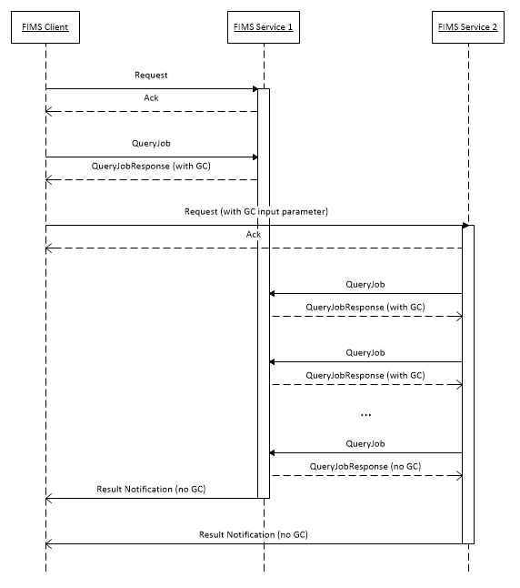

Version 1.0, October 25, 2016

Abstract
========

This document describes the incorporation of "growing content" (GC)
files into the current FIMS API set. The implementation minimizes
changes to existing APIs, and supports compatibility with older
service and client implementations.

Background
==========

The previous FIMS specification only allows operations on complete,
stable files. Clients of FIMS services specify the locations of input
files in essence locators that are contained in Business Media Objects
(BMOs). When a FIMS service processes a request, it assumes that the
input files are fixed and complete. If a FIMS service creates new files,
the result of the transaction will include new essence locators that
reference the output files, and the result is not returned to the client
until the output files are completely written.

Waiting for a file to be complete before requesting a service operation
is inefficient if the service is capable of processing an input file
while the writing of that file is in progress. This new feature will
improve efficiency by enabling "read-while-write" processing of essence
files where possible. It is understood that handling GC is not a
requirement, and services will not be mandated to accept and/or create
GC files.

Furthermore, it is an essential goal of this feature to allow full
interoperability of GC and non-GC service and client implementations,
including service implementations that were released before the version
of the FIMS specification that introduced the GC feature.

Feature Details
===============

A number of approaches were considered, including using IPC and known
streaming mechanisms to communicate GC content between services.
Ultimately, consideration focused on processing files in-place for
simplicity and compatibility. Time and effort were also considered, and
the files-in-place approach was thought to be more likely to succeed.

The basics of the method are simple:

-   GC is identified by a new class of essence locator that wraps
    existing classes of locator

-   A service can announce in-progress GC essence via BMOs returned in
    the response to a QueryJob request.

-   A GC essence locator can be included in a service request BMO

-   Pipelines can be created where output GC essence from one
    transaction can be passed as input to another transaction. In this
    case the services can communicate status and coordinate essence
    access through QueryJob requests.

GC EssenceLocatorType
---------------------

The core of the proposal is the GC essence locator. Being a new sub-type
of BMEssenceLocatorType, it should cause non-GC software to fail in an
expected way. This failure is a main element of the compatibility goal.
Since it is not possible to expect older software to correctly process
GC locators, we must implement a mechanism which forces failure. A
less-intrusive mechanism, e.g. attributes, could allow software to
misinterpret a GC locator as a regular locator, and this would likely
result in strange and hard-to-debug errors. It is preferable to cause
the failure up front at the request point. It is important to know that
failure to process a GC locator does not pose a workflow failure.
Compatibility is still ensured by a procedure that will be described
later in this document.

The GC essence locator will contain the "normal" locator that references
the essence that is being written. This is how a service will locate the
actual essence that is growing.

The other main component of a GC locator is the descriptor. This
element describes procedural aspects of the file creation, for example,
constraints on the file format that can make read-while-write more
robust. To illustrate, assume that an MXF OP-1A essence file is used as
an input to a service request. Knowing that partitions will have 300
frames could result in a more effective algorithm than one that has to
process arbitrary structure.

One element of file creation that will be enabled through the descriptor
is a line of communication from the producer of the file to the
consumer. This will be done through QueryJob requests from the consumer
service to the producer service. The producer service will respond with
an updated BMO, including GC locators that contain current information
about the growing files. In order for this communication to work, the GC
locator descriptor must contain the producer service endpoint and the
transaction ID. These values must be inserted in GC locators by the
producer service in responses to QueryJob requests. This mechanism will
be described in more detail below.

Workflow
--------

Typically, a GC workflow will initiate with a FIMS service that creates
essence files. Consider Capture, for example. A capture request today
will run until the capture finishes, then the service either notifies
the client of the resultant BMO with new essence locators or provides
the BMO in the response to a QueryJob request. A GC-enabled Capture
service will act a little differently. If the service recieves a
QueryJob request for a capture in progress, it may, if appropriate,
include a BMO with GC essence locators in the response. The calling
software can then examine that response and test the essence locators to
see if the BMO has GC essence locators. If so, then the client of the
service can use the BMO immediately in a second request instead of
waiting for the request to finish. When the capture job finishes, the
service will then return a BMO to the client with non-GC locators.

If the client component can't process GC content, then it will not
expect a valid essence locator in any QueryJob response BMO until the
job has finished. In this case, the client is perfectly compatible with
the GC service – it will not take advantage of the GC locators, but will
instead wait for completion as in the current practice.

To continue, let's assume the client is GC-capable, and it takes the BMO
from the capture service JobQuery response and passes it in a new
request to another service, for example a transcode. There are three
possibilities of compatibility:

1.  The transcode service precedes the GC specification or is newer but
    does not handle GC content

2.  The transcode service handles GC content but not in this specific
    case

3.  The transcode service handles GC content and accepts this specific
    case

In scenario 1, the older services should return an error because they do
not understand the locators. Newer services should return an error
either because they do not understand the locators, or because the do
understand them but choose not to implement the function. In scenario 2,
the service should return an error because the GC locators are not able
to be processed for this transaction. In any case, the client can then
note the error and wait for the capture to finish before re-submitting
the request to the transfer service. This is a core compatibility
design: If a client or service can't handle GC, it can ignore it and the
workflow can continue with non-GC locator when the first job is
complete.

In scenario 3, the service accepts the GC locator and starts processing
the request. The service may find an endpoint and job ID in the GC
locator, if so, it can start executing QueryJob requests to keep up with
current progress. It can use the nested BMEssenceLocatorType element to
find the GC file(s) and process them, creating output in either GC or
non-GC mode, depending on the particulars of the request profile and the
output file format. If the output is GC-capable, then the transcode
service may include the GC locators in response to a QueryJob request. A
sequence diagram to show the events is as follows:

{width="5.958333333333333in"
height="6.729166666666667in"}

The compatibility scenarios can be summarized as follows:

-   Older clients will not expect GC content, and will not make service
    requests with GC locators. This works for both older services and
    newer, GC-enabled services.

-   Newer clients should allow for errors when submitting requests with
    GC locators. If a request that contains GC locators returns an
    error, this can indicate that the locator handling is at fault, so
    the service should wait for the content to be complete, then
    re-submit the request with non-GC locators.

-   Older services will not recognize GC locators and will return an
    error if one is included in a request. Older services will not
    create GC locators in QueryJobResponse messages.

-   Newer services may accept requests with GC locators. Newer services
    may create GC locators in QueryJobResponse messages, and may
    participate in a GC communication session to help GC workflows be
    more effective. If QueryJob requests are never made for a
    transaction that has GC outputs, then the GC content will not be
    used, and further processing will be deferred until the GC
    transaction is complete.

Capability Registration
=======================

Once a mechanism for registering service capabilities emerges from the
FIMS community, it is recommended that a service that supports Growing
Content register that capability appropriately given the emergent
method.

Schema Changes
==============

See baseMediaService.xsd for definitions of the new GC types.

A new error code has been introduced (SVC_S00_0028) that should be
returned if a service cannot process a GC locator. See
baseMediaService.xsd.
